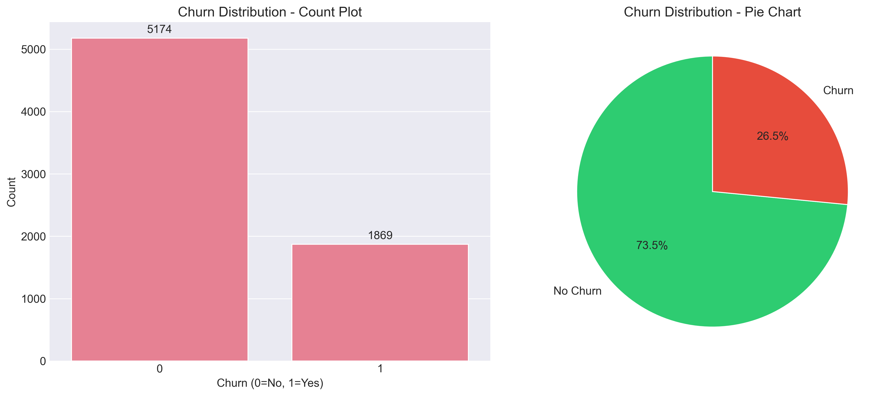
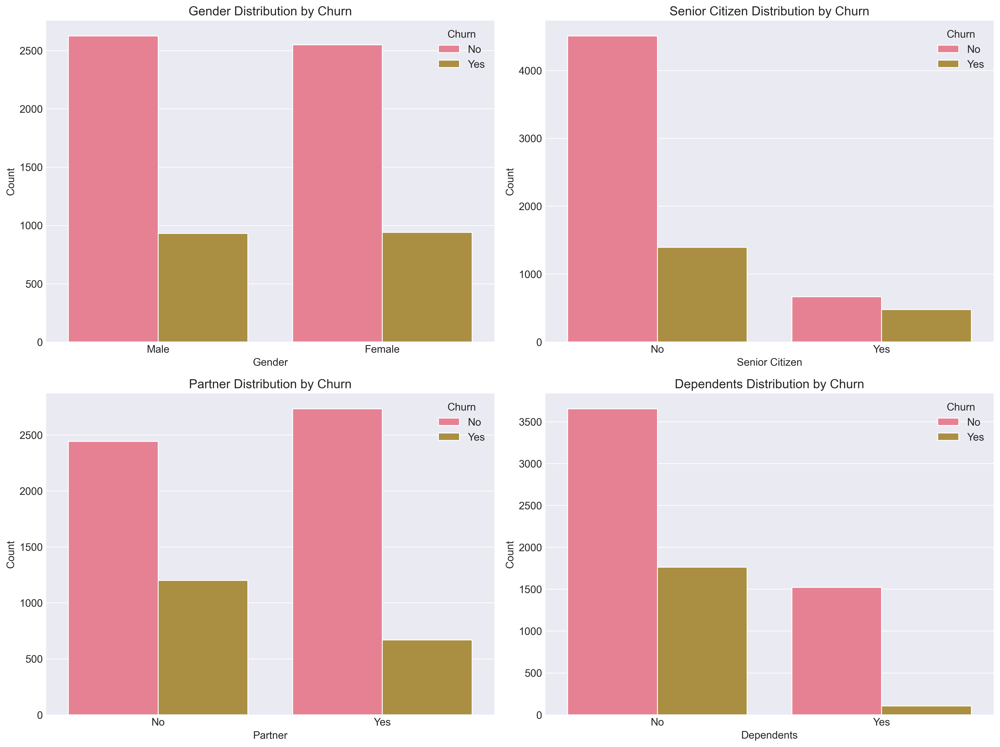
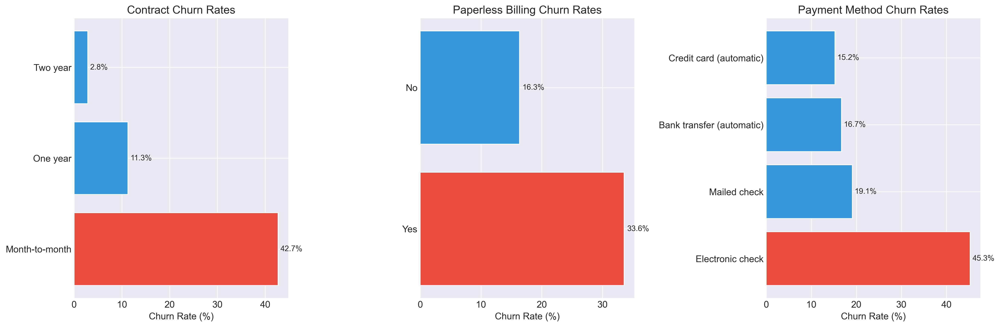
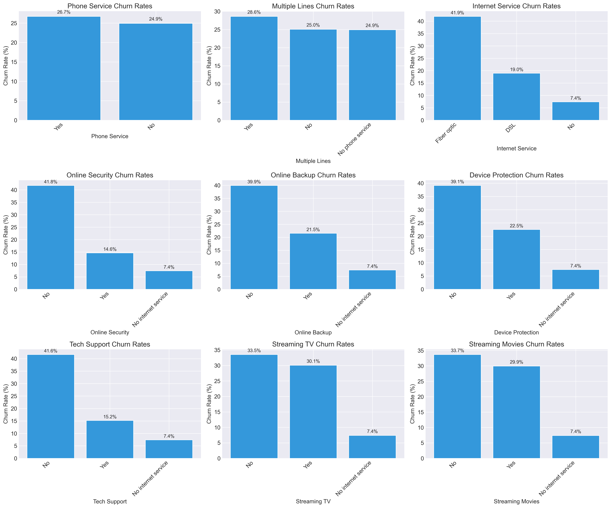
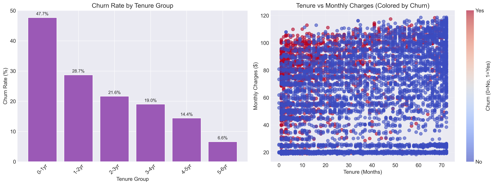
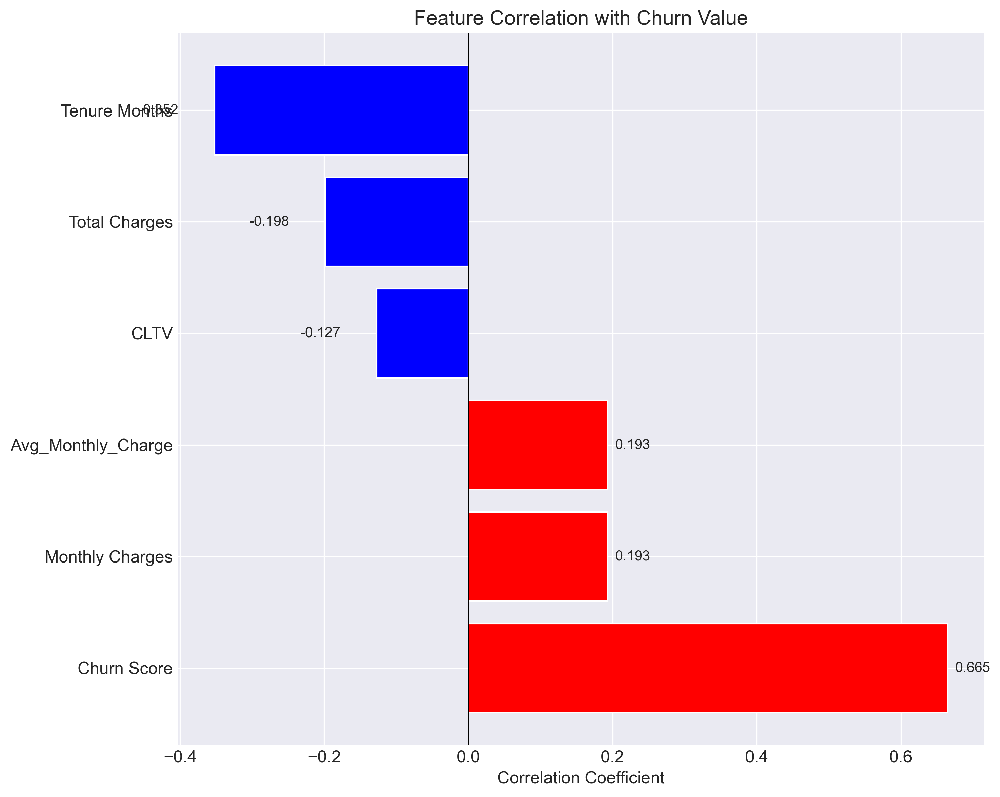
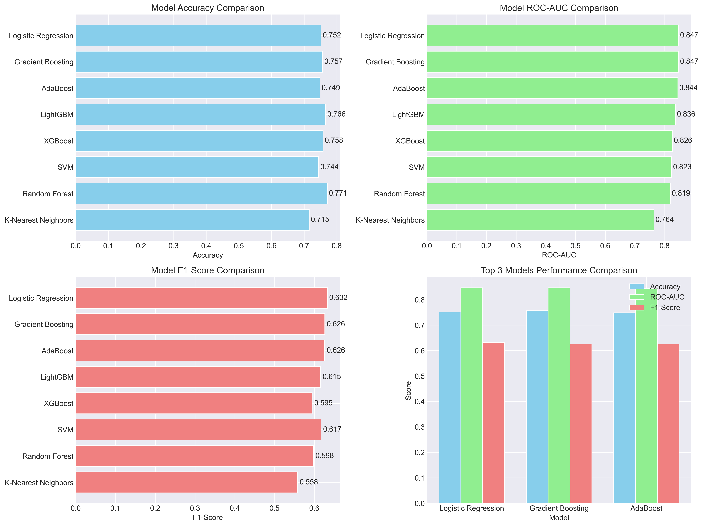
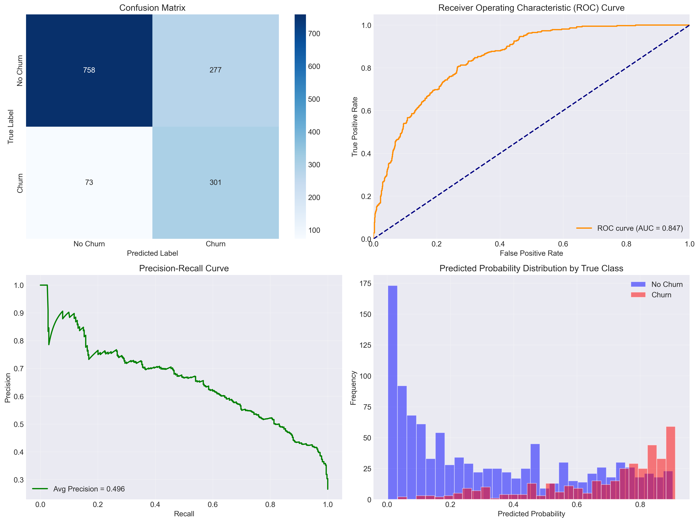

# Telco Customer Churn Analysis – Technical Report

## 1. Introduction
Customer churn represents a major revenue risk in the telecommunications industry. This report presents a complete analytical pipeline applied to the IBM Telco Customer Churn dataset, covering data exploration, exploratory data analysis (EDA), feature engineering, predictive modeling, and business impact assessment. The objective is to identify churn drivers and evaluate a deployable churn prediction model.

---

## 2. Data Exploration Summary

Initial data inspection revealed the following characteristics:

- Total records: 7,043
- Total features: 33
- Numerical features: 9
- Categorical features: 24
- Duplicate records: None
- Missing values: 5,174 (primarily in `Total Charges`)
- Key issue identified: `Total Charges` stored as string, requiring data type conversion

### Data Quality Actions
- Converted `Total Charges` to numeric format
- Handled missing values generated during conversion
- Verified feature distributions and integrity

### Generated Exploration Outputs
- `reports_2/data_exploration_insights.txt`
- `reports_2/data_exploration_summary.csv`

---

## 3. Exploratory Data Analysis

### 3.1 Churn Distribution
The churn target variable shows a natural class imbalance, common in real-world churn datasets.



**Insight:**  
Most customers remain active, making precision–recall trade-offs critical during modeling.

---

### 3.2 Demographic Analysis
Demographic characteristics reveal clear differences in churn behavior.



**Insight:**  
Senior citizens and customers without dependents exhibit higher churn rates, indicating demographic risk segments.

---

### 3.3 Contract and Billing Behavior
Contract structure and billing preferences strongly influence customer retention.



**Insight:**  
Month-to-month contracts combined with electronic billing methods show significantly higher churn probability compared to long-term contracts.

---

### 3.4 Service Usage and Churn
Service subscription patterns provide strong churn signals.



**Insight:**  
Customers using fiber optic internet and lacking online security or technical support churn at higher rates.

---

### 3.5 Tenure Analysis
Customer lifetime duration is one of the strongest churn predictors.



**Insight:**  
Churn is heavily concentrated in the early months of customer tenure and decreases steadily over time.

---

### 3.6 Correlation Analysis
Correlation analysis highlights relationships between numerical features and churn.



**Insight:**  
Tenure and monthly charges show meaningful correlation with churn, supporting their importance in modeling.

---

## 4. Feature Engineering

The following transformations were applied to prepare the dataset for modeling:

- Missing value imputation
- Categorical variable encoding
- Feature scaling using `StandardScaler`
- Class imbalance handling using SMOTE
- Feature selection using statistical relevance tests

### Final Modeling Dataset
- Samples: 7,043
- Selected features: 20

---

## 5. Predictive Modeling

### Models Evaluated
Multiple classification algorithms were trained and evaluated:

- Logistic Regression
- Random Forest
- Gradient Boosting
- XGBoost
- LightGBM
- Support Vector Machine
- K-Nearest Neighbors
- AdaBoost

Hyperparameter tuning was performed on the best-performing models using cross-validation.

---

## 6. Model Performance Evaluation

### Selected Model: Logistic Regression

| Metric | Value |
|------|------|
| Accuracy | 75.2% |
| ROC-AUC | 0.847 |
| F1-Score | 0.632 |
| Precision | 52.1% |
| Recall | 77.0% |

Cross-validation ROC-AUC: **0.855 ± 0.008**

**Rationale:**  
Logistic Regression provided the best balance between interpretability, recall, and business applicability.

---

### Model Comparison
Performance comparison across evaluated models:



---

### Best Model Evaluation
Confusion matrix and ROC evaluation of the selected model:



---

## 7. Business Insights

Key drivers of customer churn identified:

1. Month-to-month contract type
2. Fiber optic internet service
3. Lack of online security and technical support
4. Short customer tenure
5. Senior citizen demographic group

Detailed qualitative insights are documented in:
- `reports_2/business_insights_report.txt`

---

## 8. Business Impact Analysis

Estimated operational impact based on model performance:

- Average churners identified per month: ~301
- Precision: 52.1%
- Estimated annual cost savings: $174,820
- Estimated return on investment (ROI): 3025%

**Interpretation:**  
Even a moderately precise model can generate substantial financial benefits when applied at scale.

---

## 9. Limitations
- Static snapshot data (no temporal behavior modeling)
- No external customer behavior or market data
- Cost assumptions based on average customer value

---

## 10. Future Work
- Time-series churn prediction
- Customer lifetime value (CLV) modeling
- Explainable AI techniques (SHAP, LIME)
- Deployment as a real-time churn scoring service

---

## 11. How to Run the Project

### Requirements
- Python 3.8+
- Git
- Jupyter Notebook

### Installation
```bash
git clone https://github.com/bonheur832/Telcom-customer-churn-analysis.git
cd Telcom-customer-churn-analysis
pip install -r requirements.txt
